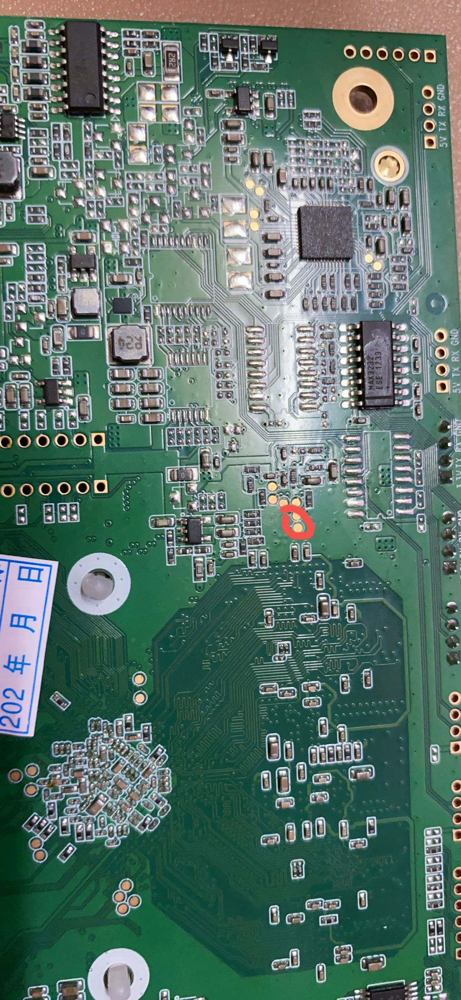
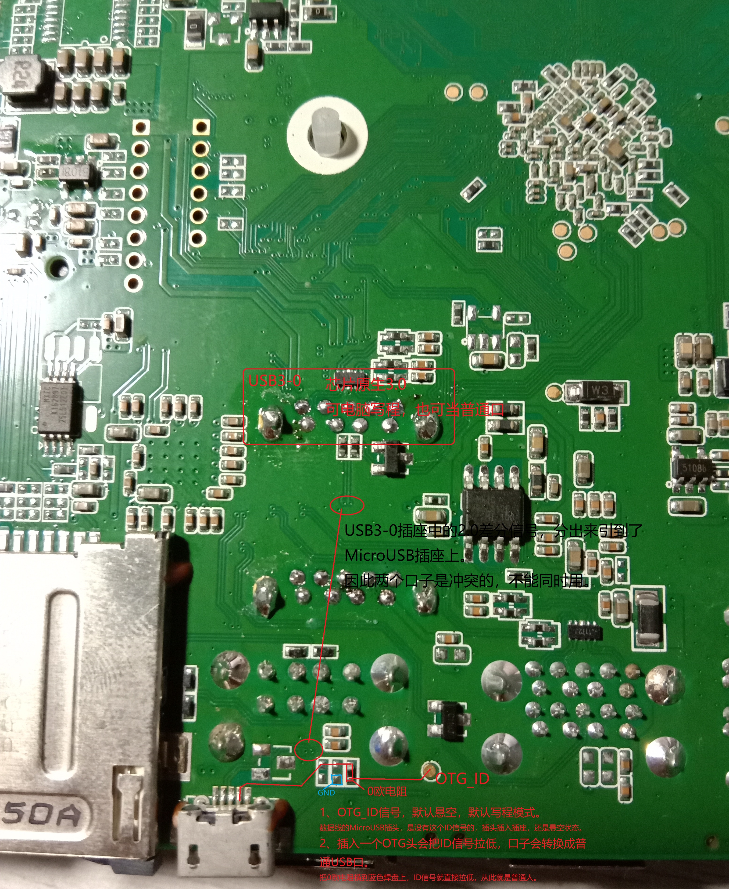

# 编译主线U-Boot

参考[lanseyujie](https://github.com/lanseyujie/tn3399_v3)的教程

## 编译ATF

### BL31

下载[源码](https://github.com/ARM-software/arm-trusted-firmware/tags)并解压，编译:

```
make CROSS_COMPILE=aarch64-linux-gnu- PLAT=rk3399 -j$(nproc)
```

编译成功后设置环境变量：

```
export BL31=arm-trusted-firmware目录/build/rk3399/release/bl31/bl31.elf
```

### OP-TEE（可选）

下载[源码](https://github.com/OP-TEE/optee_os/tags)并解压，编译:

```
make PLATFORM=rockchip-rk3399 -j$(nproc)
```

编译成功后设置环境变量：

```
export TEE=optee目录/out/arm-plat-rockchip/core/tee.bin
```

## 编译U-Boot

下载主线U-Boot[源码](https://github.com/u-boot/u-boot/tags)，解压并打上TN3399_V3的[patch](https://github.com/retro98boy/armbian-build/tree/v25.5.1/patch/u-boot/v2025.04/board_tiannuo-tn3399-v3)，编译：

```
make tn3399-v3-rk3399_defconfig && make CROSS_COMPILE=aarch64-linux-gnu- -j$(nproc)
```

编译成功后，源码目录下出现`idbloader.img` `u-boot.itb`和`u-boot-rockchip.bin`，后者由前面两个镜像根据its合并而来

## 安装U-Boot

这里使用单独的`idbloader.img`和`u-boot.itb`

`idbloader.img`应该位于系统镜像的32 KiB偏移处，`u-boot.itb`应该位于系统镜像的8 MiB偏移处，刻录命令如下：

```
# dd默认操作单位为1个block，1 block = 512 Byte，故64 block = 32 KiB，16384 block = 8192 KiB = 8 MiB
dd if=idbloader.img of=path-to-your-img seek=64 status=progress oflag=direct conv=notrunc
dd if=u-boot.itb of=path-to-your-img seek=16384 status=progress oflag=direct conv=notrunc
```

# 编译内核

## 主线内核

从kernel.org下载主线内核源码并解压，添加仓库TN3399_V3的[dts](https://github.com/retro98boy/armbian-build/blob/v25.5.1/patch/kernel/archive/rockchip64-6.12/dt/rk3399-tn3399-v3.dts)再编译

## BSP内核

BSP内核推荐[mrfixit2001](https://github.com/mrfixit2001/rockchip-kernel)维护的版本，添加本仓库的dts后再编译

# 构建发行版

## 对相同SoC的系统镜像进行移植

举例

下载nanopim4v2的[Armbian](https://mirrors.ustc.edu.cn/armbian-dl/nanopim4v2/archive/)系统镜像，使用losetup挂载img到临时目录

替换dtb为TN3399_V3

进行自定义，例如使用neovim代替nano，卸载ntfs-3g而使用ntfs3，卸载nanopim4v2的U-Boot包

最后将TN3399_V3的U-Boot刻录到镜像上

大概操作：

```
# 查找第一个未使用的loop设备，一般是/dev/loop0
sudo losetup -f
# 将/dev/loop0和img关联起来
sudo losetup /dev/loop0 path-to-your-img
# 根据img更新/dev/loop的分区
sudo partprobe /dev/loop0
# 挂载分区到临时目录（假设img有两个分区，分别为根分区和boot分区）
sudo mount /dev/loop0p2 /mnt && sudo mount /dev/loop0p1 /mnt/boot
# chroot到临时目录，主机需要安装systemd-container qemu-user-static binfmt
sudo systemd-nspawn -D /mnt -M tmp bash
# 对rootfs做些自定义，例如换源，添加预装软件等
# 退出systemd-nspawn，方式是按住 Ctrl，接着连按]三次
# 卸载分区
sudo umount -R /mnt
# 删除loop设备
sudo losetup -d /dev/loop0
# 参考上文给img烧录U-Boot
```

## 从零构建系统镜像

要使用Ubuntu可以从[这里](http://mirrors.ustc.edu.cn/ubuntu-cdimage/ubuntu-base/releases/)下载rootfs，解压到临时目录，chroot后对其进行自定义：换源、添加用户、修改主机名、语系、时区，预装安装软件等

然后将编译的内核镜像和模块放到rootfs中，配置一种引导方式，如Extlinux或者U-Boot Script，整个rootfs就可以通过U-Boot引导并正常使用

可使用dd命令创建空白镜像，对镜像进行分区，放入rootfs，最后刻录U-Boot，一个系统镜像就制作完成

x86主机chroot到arm的rootfs需要安装qemu-user-static。推荐使用systemd-nspawn来chroot

大概操作：

```
# 创建空白文件，大小自己决定
sudo dd if=/dev/zero of=~/myimg.img bs=1M count=2048 status=progress
# 给文件创建gpt分区表
sudo parted ~/myimg.img mklabel gpt
# 给文件分区，也可以使用fdisk parted等分区工具，第一个分区起始位置需要靠后，给U-Boot留下空间
sudo cfdisk ~/myimg.img
# 参考上面的操作，使用losetup挂载img,下载Ubuntu Ports的rootfs复制到img里，做些自定义，比较重要的有passwd sudo timezone locales hosts hostname fstab的配置
```

# WIFI和蓝牙

确保内核配置使能`SDIO bus interface support for FullMAC driver` `HCI UART driver` `Broadcom protocol support`，将本仓库提供的固件放到文件系统的特定位置即可

# 扬声器

板子原理图设计支持HDMI、Headphone、Speaker输出和Microphone输入，但是Headphone和Microphone的元器件全部NC，所以目前只支持HDMI和Speaker音频输出

Speaker输出由ALC5640 Codec加NS4258 PA提供，将板子散热片朝上、网口朝前放置，Speaker的输出4pin接口在板子左边缘，旁边有SPK字样，信号从上往下分别是LN、LP、RN、RP，将其接上两个喇叭

进入Linux系统后，执行aplay -l发现两个Playback设备，card0是ALC5640，card1是HDMI（序号不固定）：

```
**** List of PLAYBACK Hardware Devices ****
card 0: rockchiprt5640c [rockchip,rt5640-codec], device 0: ff890000.i2s-rt5640-aif1 rt5640-aif1-0 [ff890000.i2s-rt5640-aif1 rt5640-aif1-0]
  Subdevices: 1/1
  Subdevice #0: subdevice #0
card 1: hdmisound [hdmi-sound], device 0: ff8a0000.i2s-i2s-hifi i2s-hifi-0 [ff8a0000.i2s-i2s-hifi i2s-hifi-0]
  Subdevices: 1/1
  Subdevice #0: subdevice #0
```

使用mpv播放音乐来验证扬声器是否可用：

```
# 查看可使用的播放设备
mpv --audio-device=help
# 使用ALC5640播放
mpv --audio-device='alsa/default:CARD=rockchiprt5640c' --no-video test.mp3
```

如果无声音，可能是ALC5640内部的音频路由错误，参考下面两种方法配置音频路由

## 命令手动配置

配置Speaker的通路即可，Headphone和Microphone由于元器件NC，配置了也没用：

```
# Speaker
amixer -D hw:rockchiprt5640c cset name='Stereo DAC MIXL DAC L1 Switch' on
amixer -D hw:rockchiprt5640c cset name='Stereo DAC MIXR DAC R1 Switch' on
amixer -D hw:rockchiprt5640c cset name='SPOL MIX DAC L1 Switch' on
amixer -D hw:rockchiprt5640c cset name='SPOR MIX DAC R1 Switch' on
amixer -D hw:rockchiprt5640c cset name='Speaker L Playback Switch' on
amixer -D hw:rockchiprt5640c cset name='Speaker R Playback Switch' on
# 音量 0 - 39
# amixer -D hw:rockchiprt5640c cset name='Speaker Playback Volume' 39

# Headphone
amixer -D hw:rockchiprt5640c cset name='Stereo DAC MIXL DAC L1 Switch' on
amixer -D hw:rockchiprt5640c cset name='Stereo DAC MIXR DAC R1 Switch' on
amixer -D hw:rockchiprt5640c cset name='HPO MIX DAC1 Switch' on
amixer -D hw:rockchiprt5640c cset name='HP L Playback Switch' on
amixer -D hw:rockchiprt5640c cset name='HP R Playback Switch' on
# 音量 0 - 39
# amixer -D hw:rockchiprt5640c cset name='HP Playback Volume' 39

# Microphone_IN1
amixer -D hw:rockchiprt5640c cset name='RECMIXL BST1 Switch' on
amixer -D hw:rockchiprt5640c cset name='RECMIXR BST1 Switch' on
amixer -D hw:rockchiprt5640c cset name='Stereo ADC MIXL ADC1 Switch' on
amixer -D hw:rockchiprt5640c cset name='Stereo ADC MIXR ADC1 Switch' on
```

## UCM自动配置（推荐）

将`rockchip,rt5640-codec.conf`和`rockchip,rt5640-codec-HiFi.conf`移动到板子系统的`/usr/share/alsa/ucm2/conf.d/simple-card`中重启即可

conf文件在仓库的sound目录下

如果系统不存在`/usr/share/alsa/ucm2/conf.d/simple-card`可以安装alsa-ucm-conf：

```
# Armbian
sudo apt install alsa-ucm-conf
```

PS：ALC5640的控制选项较多，如果自己使用amxier/alsamixer折腾后发现音频路由混乱而无法正常使用，可通过下面的方法恢复：

```
# 配置会被保存到asound.state，删除后重启即可
# 删除前停止自动保存的service
sudo systemctl stop alsa-restore.service && sudo rm /var/lib/alsa/asound.state && sudo reboot
```

参考：

[The audio ALC5640 can’t work on I2S0 and I2C2 for Xaiver NX](https://forums.developer.nvidia.com/t/the-audio-alc5640-cant-work-on-i2s0-and-i2c2-for-xaiver-nx/179617)

[Advanced Linux Sound Architecture](https://wiki.archlinux.org/title/Advanced_Linux_Sound_Architecture)

[ALSA project - the C library reference](https://www.alsa-project.org/alsa-doc/alsa-lib/group__ucm__conf.html)

# 固件

[Armbian](https://github.com/retro98boy/armbian-build)

[Batocera](https://github.com/retro98boy/batocera.linux)

[OpenWrt](https://github.com/retro98boy/openwrt)

# 杂项




